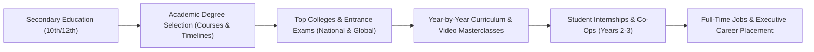
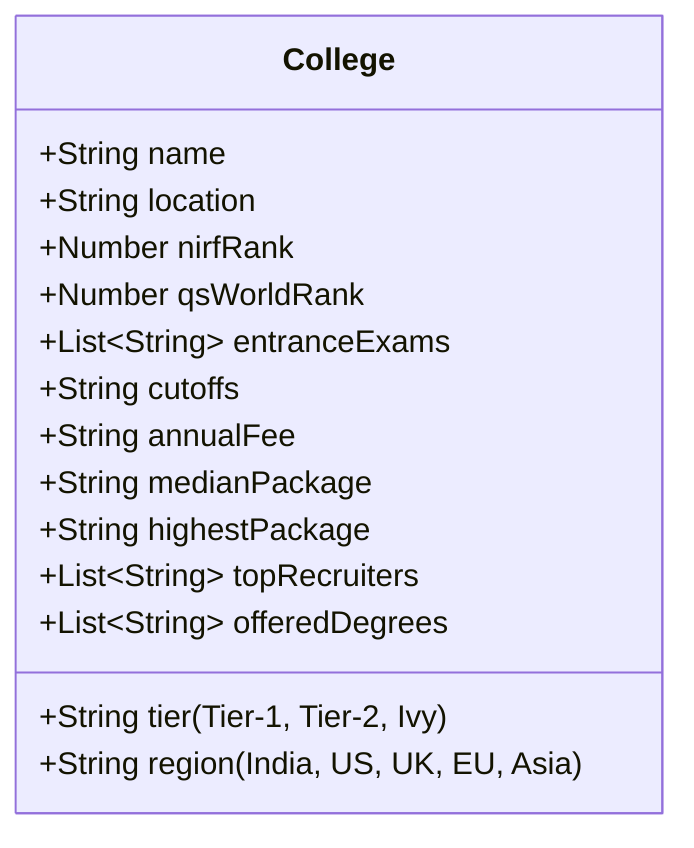
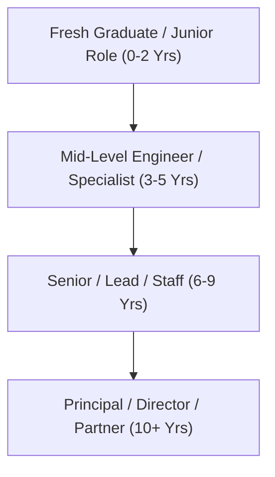
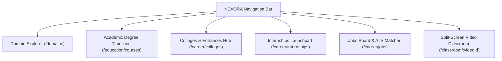
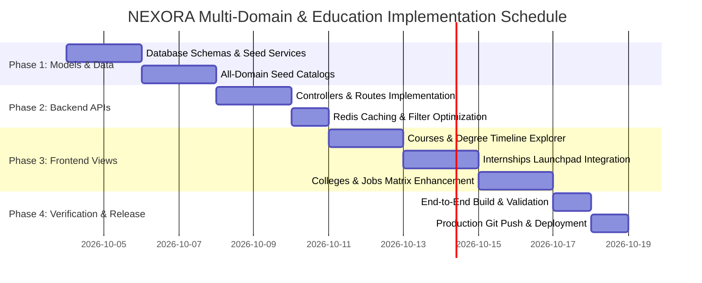

# NEXORA Platform — Comprehensive Education, Domains, Colleges, Internships & Jobs Implementation Plan

## 1. Executive Blueprint & Vision

**NEXORA** is evolving from a software-engineering focused roadmap platform into an **End-to-End Career & Education Intelligence Super-Platform**. 

The expanded ecosystem connects every critical phase of a student's and professional's journey across **all major academic streams and industrial disciplines**:



This implementation document provides the definitive architectural blueprint, universal taxonomy, database schemas, REST APIs, frontend interfaces, and phased execution roadmap to power:
1. **All Educational Domains & Streams** (Engineering, Medicine/Healthcare, Business/Commerce, Law, Sciences, Design, Humanities).
2. **All Degree Courses & Timelines** (Diplomas, 3-4 Year Undergrad, 2-Year Postgrad, 5-Year Integrated, Doctoral/PhD).
3. **Colleges & Universities Matrix** (Top Tier-1, Tier-2, Global Ivies, NIRF/QS rankings, cutoffs, tuition, placements).
4. **Student Internships Engine** (Co-ops, summer internships, stipends, batch tracking).
5. **Full-Time Jobs Catalog** (Global tech giants, healthcare networks, financial institutions, core engineering, public sectors).

---

## 2. Universal Domain Taxonomy (7 Super-Domains, 35+ Real-Time Domains)

NEXORA organizes all career trajectories into 7 macro-sectors, covering both technology and non-technology paths:

### Super-Domain A: Computing, Artificial Intelligence & Information Systems
* **DA-1. Full-Stack & Distributed Cloud Systems**: MERN, Go microservices, distributed caching, Kubernetes.
* **DA-2. Artificial Intelligence, Machine Learning & LLMs**: Generative AI, PyTorch, RAG, transformer architectures, MLOps.
* **DA-3. Mobile & Ubiquitous Computing**: Flutter, React Native, Swift iOS, Kotlin Android, offline-first architectures.
* **DA-4. Cybersecurity & Information Defense**: Ethical hacking, SOC analysis, cryptography, network vulnerability assessment.
* **DA-5. DevOps, Cloud & Site Reliability Engineering (SRE)**: AWS/GCP, Terraform, CI/CD pipelines, Prometheus, ArgoCD.
* **DA-6. Blockchain, Decentralized Finance & Web3**: Solidity, EVM smart contracts, zero-knowledge proofs, Rust on Solana.
* **DA-7. Game Engine Design & Real-Time Computer Graphics**: Unreal Engine 5, C++, Unity, Vulkan/DirectX 12, shader engineering.
* **DA-8. Data Engineering, Big Data & Advanced Analytics**: Apache Spark, Kafka, Snowflake, dbt, real-time telemetry.

### Super-Domain B: Core Engineering & Advanced Technologies
* **DB-1. Electronics, Communication & VLSI Design**: Semiconductor physics, Verilog/VHDL, FPGA programming, 5G/6G RF.
* **DB-2. Robotics, Automation & Mechatronics**: ROS 2, inverse kinematics, sensor fusion, PLC automation, computer vision.
* **DB-3. Mechanical Systems, Automotive & EV Engineering**: CAD/CAM (SolidWorks, CATIA), FEA/CFD, electric powertrain, battery management.
* **DB-4. Aerospace & Avionics Engineering**: Aerodynamics, propulsion, orbital mechanics, flight control software.
* **DB-5. Civil, Structural & Urban Infrastructure**: BIM modeling, seismic design, geotechnical engineering, sustainable cities.
* **DB-6. Chemical, Process & Materials Engineering**: Polymer synthesis, petrochemical refinement, green hydrogen, nanotechnology.

### Super-Domain C: Medicine, Healthcare & Life Sciences
* **DC-1. Clinical Medicine & Surgery**: Internal medicine, general surgery, pediatrics, diagnostic pathology, emergency care.
* **DC-2. Dental Surgery & Oral Health**: Orthodontics, periodontics, prosthodontics, maxillo-facial surgery.
* **DC-3. Pharmaceutical Sciences & Drug Discovery**: Pharmacology, molecular biology, clinical trials, FDA regulatory compliance.
* **DC-4. Biotechnology, Bioinformatics & Genomics**: Next-generation sequencing (NGS), CRISPR gene editing, computational protein folding.
* **DC-5. Nursing & Advanced Patient Care**: Critical care nursing, oncology nursing, hospital administration, patient triaging.
* **DC-6. Allied Health Sciences & Physiotherapy**: Neuro-rehabilitation, medical imaging/radiology, cardiac care technology.

### Super-Domain D: Business, Management, Finance & Commerce
* **DD-1. Investment Banking & Financial Markets**: Equity research, mergers & acquisitions, algorithmic trading, financial modeling.
* **DD-2. Chartered Accountancy, Audit & Corporate Taxation**: IFRS, statutory audit, transfer pricing, corporate finance.
* **DD-3. Strategic Management & Business Consulting**: McKinsey/Bain case frameworks, market entry strategy, operations turnaround.
* **DD-4. Digital Marketing, Growth & Brand Strategy**: Performance marketing, SEO/SEM, funnel optimization, viral loops.
* **DD-5. Supply Chain, Logistics & Operations**: Lean Six Sigma, ERP systems (SAP), procurement, freight logistics.
* **DD-6. Product Management & Venture Entrepreneurship**: PRD authoring, unit economics, A/B experimentation, startup scaling.

### Super-Domain E: Law, Public Policy & Governance
* **DE-1. Corporate Law, M&A & Intellectual Property**: Cross-border transactions, patent filing, antitrust compliance.
* **DE-2. Criminal Defense & Human Rights Advocacy**: Criminal procedure, constitutional litigation, human rights law.
* **DE-3. Public Policy, International Relations & Diplomacy**: Geopolitical analysis, civil services (UPSC/Foreign Service), NGO administration.

### Super-Domain F: Design, Architecture & Creative Media
* **DF-1. Digital Product & UI/UX Design**: Figma, interaction design, micro-animations, human-computer interaction (HCI).
* **DF-2. Architecture, Spatial & Interior Design**: Architectural BIM, sustainable building envelopes, urban planning.
* **DF-3. Animation, VFX, CGI & Digital Storytelling**: Maya, Blender, Houdini VFX, digital character modeling.

### Super-Domain G: Pure & Applied Sciences
* **DG-1. Physics & Quantum Technologies**: Quantum computing (Qiskit), condensed matter, optics, theoretical astrophysics.
* **DG-2. Pure Mathematics, Cryptography & Statistics**: Number theory, Bayesian inference, stochastic calculus, topology.
* **DG-3. Chemical Sciences & Sustainable Energy**: Organic synthesis, renewable catalysis, battery chemistry.

---

## 3. Comprehensive Education Courses & Academic Timelines

NEXORA models each educational qualification with clear prerequisite streams, duration, semester/yearly breakdowns, and verified career exit paths:

| Level | Course / Degree | Duration | Entry Criteria / Exams | Target Specializations | Exit Roles |
| :--- | :--- | :--- | :--- | :--- | :--- |
| **Secondary** | 10th / Matriculation | 1 Year | School board exams | Foundation STEM / Arts | Junior College / Polytechnic |
| **Pre-Univ** | 11th & 12th (MPC / Science) | 2 Years | 10th Board (State/CBSE/ICSE) | PCM, Computer Science, Electronics | Engineering & Pure Science UG |
| **Pre-Univ** | 11th & 12th (BiPC / Medical) | 2 Years | 10th Board | Biology, Physics, Chemistry | Medicine, Pharmacy, Biotech UG |
| **Pre-Univ** | 11th & 12th (Commerce/MEC) | 2 Years | 10th Board | Accountancy, Economics, Business | CA Foundation, BBA, B.Com, Law |
| **Undergrad** | **B.Tech / B.E.** | 4 Years (8 Sems) | JEE Main, JEE Adv, BITSAT, State CET | CS, AI, ECE, Mechanical, Civil, Biotech | Software Engineer, SDE, Core Engineer |
| **Undergrad** | **MBBS** | 5.5 Years (4.5y + 1y Intern) | NEET-UG | Clinical Medicine, Surgery, Pediatrics | Resident Doctor, Medical Officer, MD Aspirant |
| **Undergrad** | **B.Sc / B.S. (Honors)** | 3-4 Years | CUET, SAT, State Merit | Physics, Mathematics, Data Science, Chemistry | Research Analyst, Data Scientist, Lab Scientist |
| **Undergrad** | **BBA / BMS** | 3 Years (6 Sems) | IPMAT, CUET, SET, Merit | Finance, Marketing, Operations, Analytics | Business Analyst, Associate Consultant |
| **Undergrad** | **B.Com (Honours)** | 3 Years | CUET, 12th Board Merit | Accounting, Taxation, Corporate Law | Financial Analyst, Audit Associate, CA/CPA |
| **Undergrad** | **BA LLB / BBA LLB** | 5 Years (10 Sems) | CLAT, AILET, LSAT | Corporate Law, Criminal Law, IPR, Cyber Law | Associate Attorney, Legal Advisor, In-House Counsel |
| **Undergrad** | **B.Des (Design)** | 4 Years | UCEED, NID DAT, NIFT | UI/UX, Industrial, Communication Design | Product Designer, UX Architect, Visual Designer |
| **Undergrad** | **B.Pharm** | 4 Years | NEET-UG / State Pharma CET | Pharmacology, Pharmaceutics, Chemistry | Drug Safety Associate, Formulation Scientist |
| **Postgrad** | **M.Tech / M.E.** | 2 Years (4 Sems) | GATE, GRE | AI, VLSI, Thermal, Structural, Robotics | Senior Engineer, R&D Scientist, Tech Lead |
| **Postgrad** | **MBA / PGDM** | 2 Years (Trimesters) | CAT, GMAT, XAT, MAT | Strategy, Finance, Consulting, Product | Product Manager, Investment Banker, Strategy Lead |
| **Postgrad** | **MS (Global STEM)** | 2 Years | GRE, TOEFL/IELTS, GPA | CS, Data Science, Biomedical, Materials | Global SDE, Machine Learning Scientist |
| **Postgrad** | **MD / MS (Medical)** | 3 Years | NEET-PG | Cardiology, Radiology, Dermatology, Surgery | Specialist Physician, Surgeon, Consultant |
| **Doctoral** | **Ph.D / D.Phil** | 3-5 Years | CSIR-NET, GATE, Proposal | Quantum, Advanced AI, Bio-Nanotech | Principal Scientist, University Professor, R&D Director |

### Timeline Progression Architecture (Year-by-Year / Semester-by-Semester)

For every degree (e.g. 4-Year B.Tech in CS or 5.5-Year MBBS):
* **Year 1: Core Fundamentals & Prerequisite Tools**: Math, basic programming, hardware/anatomy foundations, scientific methodology.
* **Year 2: Intermediate Systems & Hands-on Labs**: Data structures, operating systems, clinical pathology, corporate accounting, micro-projects.
* **Year 3: Domain Specialization & Summer Internships**: Advanced electives (AI, Cloud, Surgery, Corporate Finance), portfolio building, industrial co-ops.
* **Year 4: Capstone Engineering, Clinical Rotations & Campus Placements**: Thesis project, peer review, mock interviews, corporate placement drives.

---

## 4. Comprehensive Colleges & Universities Matrix

NEXORA links each course and domain directly to the world's most prestigious and high-return educational institutes:



### Premier Institutional Profiles (Sample Matrix)

#### 1. Indian Premier STEM & Computing
* **IIT Bombay / IIT Delhi / IIT Madras**:
  * *Degrees*: B.Tech (4y), M.Tech (2y), Dual Degree (5y), Ph.D.
  * *Entrances*: JEE Advanced (Top 50 - 1500 rank for CS/ECE).
  * *Fees*: ₹2.2 Lakhs/year (Full waivers for SC/ST/low income).
  * *Median Package*: ₹21.5 LPA (Domestic) · Up to $180,000 (International).
  * *Recruiters*: Google, Microsoft, Qualcomm, Jane Street, Goldman Sachs.
* **BITS Pilani (Pilani, Goa, Hyderabad)**:
  * *Degrees*: B.E. (Hons), M.Sc Dual Degree.
  * *Entrances*: BITSAT (Score 320+/390 for CS).
  * *Fees*: ₹5.5 Lakhs/year.
  * *Median Package*: ₹19 LPA · Practice School (PS-II) mandatory 6-month corporate internship.

#### 2. Global Premier Universities (US, UK, Europe, Singapore)
* **MIT (Massachusetts Institute of Technology, USA)**:
  * *Degrees*: BS in EECS, Artificial Intelligence & Decision Making, M.Eng, PhD.
  * *Admissions*: Holistic review, SAT 1540+, Olympiads, Research publications.
  * *Fees*: $60,000/year (100% need-blind financial aid for all admitted students).
  * *Median Package*: $145,000/year base + equity.
* **Stanford University (California, USA)**:
  * *Degrees*: BS CS, MS Computer Science, MBA (Stanford GSB).
  * *Highlights*: Direct Silicon Valley pipeline, venture capital incubation.
* **Oxford & Cambridge Universities (UK)**:
  * *Degrees*: BA (Hons) Computer Science, Medicine, Law (Jurisprudence).
  * *Entrances*: STEP/MAT exams + rigorous collegiate interview.
* **National University of Singapore (NUS)** & **ETH Zurich (Switzerland)**:
  * Top European & Asian centers for quantum engineering, algorithms, and biotechnology.

#### 3. Medical & Healthcare Institutions
* **AIIMS New Delhi**:
  * *Degrees*: MBBS (5.5y), MD/MS, DM/M.Ch.
  * *Entrances*: NEET-UG (AIR 1 - 50).
  * *Fees*: ~₹1,628 (Highly subsidized national institute).
  * *Clinical Exposure*: 10,000+ daily outpatients, state-of-the-art trauma centers.
* **Christian Medical College (CMC Vellore)**:
  * Ranked #3 in India, known for clinical research, community health, and surgery.
* **Johns Hopkins University (Baltimore, USA)**:
  * World-leading biomedical, surgical, and public health research institution.

#### 4. Business, Commerce & Law Institutions
* **IIM Ahmedabad / IIM Bangalore / IIM Calcutta**:
  * *Degrees*: PGP / MBA (2y), Executive MBA.
  * *Entrances*: CAT (99.5+ percentile) + Personal Interview & WAT.
  * *Median Package*: ₹34 LPA. Top recruiters: McKinsey, BCG, Blackstone, Morgan Stanley.
* **National Law School of India University (NLSIU Bangalore)**:
  * *Degrees*: 5-Year Integrated BA LLB (Hons), LLM.
  * *Entrances*: CLAT (Top 100 All India Rank).
  * *Placements*: Magic Circle law firms, Supreme Court clerkships, corporate counsel.

---

## 5. Real-World Jobs Directory (Across All Domains & Timelines)

For each domain and degree level, NEXORA maintains a live, indexed jobs database with verified compensation metrics, hiring requirements, and career progression ladders:



### Comprehensive Jobs Matrix

| Domain | Role Title | Hierarchy | Avg. Compensation (India) | Avg. Compensation (US/Global) | Top Hiring Companies | Key Technical Competencies |
| :--- | :--- | :--- | :--- | :--- | :--- | :--- |
| **Cloud & Distributed** | Cloud Systems Architect | Lead / Staff | ₹45 – 75 LPA | $210k – $320k | Google Cloud, AWS, Datadog | Go, Kubernetes, eBPF, Distributed Consensus |
| **AI / Machine Learning** | Generative AI Research Engineer | Mid – Senior | ₹32 – 55 LPA | $180k – $280k | OpenAI, Anthropic, Meta, Nvidia | PyTorch, CUDA, RLHF, Vector Databases |
| **Full Stack** | Senior Software Engineer | Senior | ₹24 – 42 LPA | $145k – $210k | Microsoft, Stripe, Uber, Atlassian | React 19, TypeScript, PostgreSQL, Kafka |
| **Cybersecurity** | Offensive Security / Red Team Lead | Senior | ₹28 – 48 LPA | $160k – $240k | CrowdStrike, Mandiant, Palo Alto | Reverse Engineering, Kernel Exploitation, SIEM |
| **Semiconductor / ECE**| ASIC / VLSI Design Engineer | Mid – Senior | ₹22 – 40 LPA | $150k – $220k | Intel, Qualcomm, AMD, Apple | SystemVerilog, UVM, Synopsys Design Compiler |
| **Automotive / EV** | Battery Management Systems Engineer| Mid | ₹16 – 28 LPA | $120k – $165k | Tesla, Rivian, Tata Motors, Ather | MATLAB/Simulink, Embedded C, CAN bus, Thermal FEA |
| **Clinical Medicine** | Consultant Cardiologist / Surgeon | Specialist | ₹36 – 80 LPA | $350k – $600k | Apollo Hospitals, Mayo Clinic, Fortis | Interventional Angioplasty, Echocardiography, MD/DM |
| **Bio & Pharma** | Clinical Drug Development Scientist | Senior | ₹20 – 35 LPA | $130k – $185k | Pfizer, Novartis, Biocon, AstraZeneca | Molecular Assays, Pharmacokinetics, GCP Compliance |
| **Finance & M&A** | Investment Banking Associate | Mid | ₹30 – 60 LPA | $175k – $275k | Goldman Sachs, J.P. Morgan, Morgan Stanley | LBO Modeling, DCF Valuation, Pitchbook Creation |
| **Corporate Law** | Senior Associate (Private Equity) | Senior | ₹25 – 50 LPA | $200k – $350k | Cyril Amarchand Mangaldas, Kirkland & Ellis | Due Diligence, Term Sheets, Cross-Border M&A |
| **Product Design** | Lead Product / UX Designer | Lead | ₹26 – 45 LPA | $150k – $220k | Apple, Airbnb, Figma, Swiggy | Design Systems, Usability Benchmarking, Micro-interactions |
| **Management** | Principal Product Manager | Principal | ₹45 – 80 LPA | $220k – $350k | Amazon, Google, Salesforce, Flipkart | Strategic Roadmapping, Growth Metrics, Unit Economics |

---

## 6. High-Impact Student Internships Engine

NEXORA provides a dedicated real-time internship tracker specifically tailored to university students across degrees and batches (2026, 2027, 2028):

### Internship Categories & Archetypes
1. **MNC Summer Internships (10-12 Weeks)**: Conducted between Year 3 and Year 4 of undergrad. High PPO (Pre-Placement Offer) conversion rate (60-80%).
2. **Industrial Co-Ops (6 Months)**: Full-semester placements during final year.
3. **Clinical Clerkships & House Surgeries**: Mandatory 12-month rotating internships in tertiary teaching hospitals for MBBS/BDS students.
4. **Legal & Court Clerkships**: 4-8 week winter/summer internships with High Court judges, law firms, and human rights bodies.
5. **Academic & Research Fellowships**: Sponsored research at institutes like CERN, Max Planck, IISc, and MIT Summer Research Program (MSRP).

### Sample Real-Time Internship Opportunities
* **Google STEP Internship**:
  * *Target*: 1st and 2nd Year undergraduate CS students.
  * *Stipend*: ₹80,000 – ₹1,15,000 / month ($45/hr in US).
  * *Focus*: Data structures, algorithmic problem solving, pair programming.
* **Microsoft Explore Program**:
  * *Target*: Undergrads exploring both Software Engineering and Product Management.
  * *Stipend*: ₹90,000 / month.
* **Goldman Sachs Summer Analyst**:
  * *Target*: Pre-final year B.Tech, B.Com, and Economics students.
  * *Stipend*: ₹1,00,000 / month. Global markets and engineering divisions.
* **Biocon Biologics Research Intern**:
  * *Target*: B.Pharm, M.Sc Biotechnology students.
  * *Stipend*: ₹25,000 / month + laboratory access.
* **Tata Motors EV Powertrain Intern**:
  * *Target*: Mechanical / EEE / Automotive undergrads.
  * *Stipend*: ₹35,000 / month.

---

## 7. Unified Database Architecture (Mongoose Models)

To support this expanded scope, the backend MongoDB schema will be expanded with four new high-performance models:

### 7.1. Education Domain Schema (`domainCatalog.model.ts`)
```typescript
import mongoose, { Document, Schema } from 'mongoose';

export interface IDomainCatalog extends Document {
  domainId: string; // e.g. 'fullstack', 'biotech', 'corporate_law'
  superDomain: string; // 'Computing', 'Core Engineering', 'Medicine', etc.
  title: string;
  description: string;
  icon: string;
  associatedDegrees: string[]; // ['B.Tech', 'M.Tech', 'B.Sc']
  typicalSalaries: {
    entryLevel: string;
    seniorLevel: string;
  };
  keyCompetencies: string[];
  activeLearnersCount: number;
}
```

### 7.2. Education Course & Degree Timeline Schema (`courseCatalog.model.ts`)
```typescript
export interface ICourseCatalog extends Document {
  courseId: string; // e.g. 'btech_cs', 'mbbs', 'bba_finance'
  name: string; // 'Bachelor of Technology in Computer Science'
  level: 'Secondary' | 'Undergraduate' | 'Postgraduate' | 'Doctoral' | 'Diploma';
  durationYears: number;
  totalSemesters: number;
  eligibility: string;
  entranceExams: string[];
  yearlyCurriculum: Array<{
    yearNumber: number;
    title: string;
    focusAreas: string[];
    coreSubjects: string[];
    recommendedInternshipWindow?: string;
    capstoneMilestone?: string;
  }>;
  associatedDomainIds: string[];
}
```

### 7.3. College & University Matrix Schema (`collegeCatalog.model.ts`)
```typescript
export interface ICollegeCatalog extends Document {
  collegeId: string;
  name: string;
  tier: 'Tier-1' | 'Tier-2' | 'Ivy League' | 'Global Premier';
  region: 'india' | 'north_america' | 'uk' | 'europe' | 'east_asia' | 'global';
  location: string;
  accreditation: string; // 'NAAC A++', 'ABET', 'NIRF Rank 1'
  rankings: {
    nationalRank?: number;
    qsWorldRank?: number;
  };
  offeredCourses: string[]; // references courseId
  entranceExamsAccepted: string[];
  cutoffsSummary: string;
  annualTuitionFee: string;
  hostelFee?: string;
  scholarshipsAvailable: boolean;
  placementStats: {
    medianPackage: string;
    highestPackage: string;
    placementRatePercent: number;
    topRecruitingCompanies: string[];
  };
  websiteUrl: string;
}
```

### 7.4. Unified Job & Internship Postings Schema (`opportunity.model.ts`)
```typescript
export interface IOpportunity extends Document {
  opportunityId: string;
  title: string;
  company: string;
  logoUrl?: string;
  type: 'Full-Time' | 'Internship' | 'Co-Op' | 'Fellowship';
  domainId: string;
  degreeEligibility: string[]; // ['B.Tech', 'BBA', 'MBBS']
  targetBatchYears: string[]; // ['2026', '2027', '2028']
  location: string;
  isRemote: boolean;
  compensation: {
    salaryOrStipend: string;
    isMonthlyStipend: boolean;
    currency: string;
  };
  applicationDeadline: Date;
  requiredSkills: string[];
  responsibilities: string[];
  requirements: string[];
  applyUrl: string;
  verifiedStatus: boolean;
}
```

---

## 8. RESTful API Endpoints Specification

| Method | Endpoint | Description | Cache Strategy |
| :--- | :--- | :--- | :--- |
| `GET` | `/api/v1/domains/all` | List all 35+ domains grouped by 7 super-domains | Redis 24h TTL |
| `GET` | `/api/v1/domains/:domainId` | Domain details, salary trends, associated courses | Redis 6h TTL |
| `GET` | `/api/v1/courses/all` | Catalog of degrees across all education tiers | Redis 24h TTL |
| `GET` | `/api/v1/courses/:courseId/timeline` | Semester-by-semester curriculum & milestone DAG | Redis 24h TTL |
| `GET` | `/api/v1/colleges/search` | Search colleges by degree, region, entrance exam, cutoffs | Database index + query |
| `GET` | `/api/v1/colleges/:collegeId` | Detailed profile, placements, fees, cutoffs | Redis 12h TTL |
| `GET` | `/api/v1/opportunities/jobs` | Filterable job postings by domain, role, salary, location | MongoDB Text & Compound Index |
| `GET` | `/api/v1/opportunities/internships`| Student internships filtered by batch year, domain, stipend | MongoDB Compound Index |
| `GET` | `/api/v1/opportunities/:id` | Full description, responsibilities, direct apply link | Redis 1h TTL |

---

## 9. Frontend Architecture & User Experience



### Key UI Capabilities:
1. **Interactive Timeline Navigator**:
   * Students choose their degree (e.g. B.Tech Computer Science, MBBS, BBA).
   * Visual horizontal roadmap from Year 1 to Graduation.
   * Direct milestones highlighting:
     * When to prepare for entrance exams.
     * When to take core video masterclasses.
     * When to apply for summer internships (Year 2 & 3).
     * When to sit for campus placements (Year 4).
2. **College Finder & Cutoff Calculator**:
   * Interactive filters for Region (India, US, UK, Global), Entrance Exams (JEE, NEET, CAT, CLAT, SAT, GRE), and Budget/Fees.
   * 1-Click comparison between institutions (Fees vs. Median Placement ROI).
3. **Dual Opportunities Board (Jobs & Internships)**:
   * Dedicated tab switcher: **"Full-Time Jobs"** vs. **"Student Internships & Co-Ops"**.
   * Batch year filter pills (`2026 Batch`, `2027 Batch`, `2028 Batch`).
   * Match score indicator based on user's profile competencies and completed roadmap milestones.

---

## 10. Phased Implementation Roadmap



### Milestone Deliverables:
* **Phase 1**: Define `domainCatalog`, `courseCatalog`, `collegeCatalog`, and `opportunity` Mongoose models. Create seed datasets covering all 7 super-domains and 35+ real-time domains.
* **Phase 2**: Implement Express controllers and routes with robust pagination, text search, and Redis caching.
* **Phase 3**: Build frontend pages (`CourseTimelines.jsx`, `Internships.jsx`, enhanced `Colleges.jsx` and `Jobs.jsx`). Connect cross-links between course timelines and video classrooms.
* **Phase 4**: Full-stack build validation (`npm --prefix backend run build` and `npm --prefix frontend run build`), clean git check (0 test files), and push to GitHub `origin/main`.
